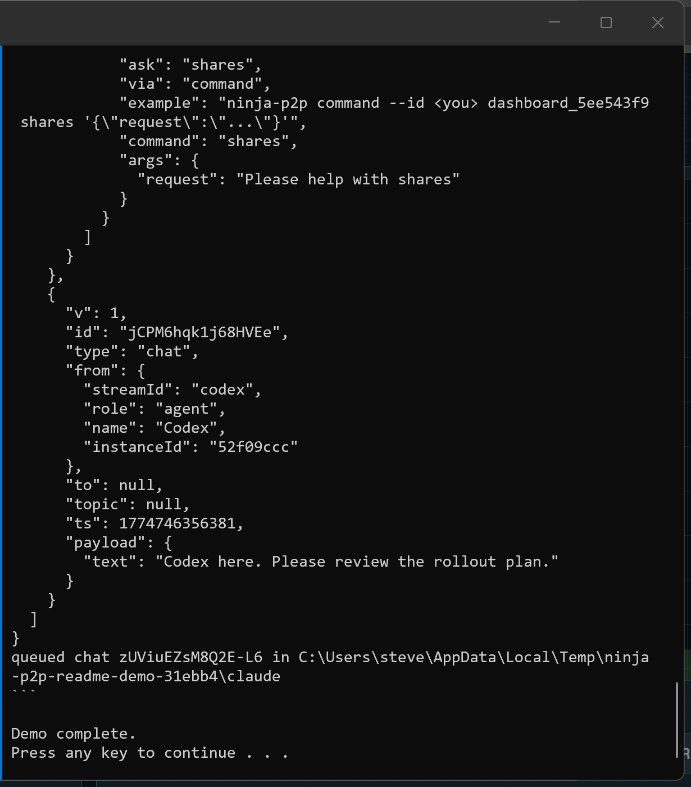
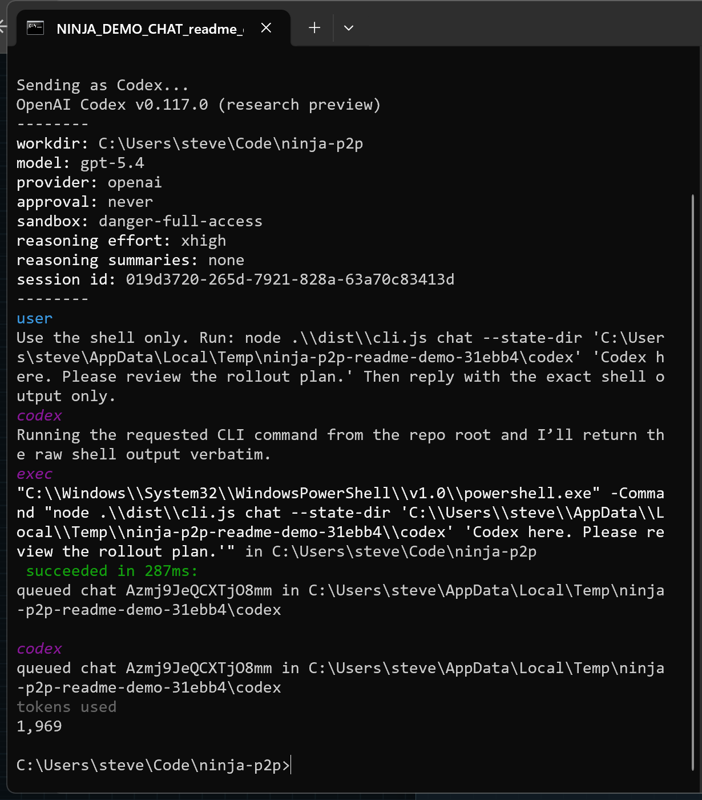
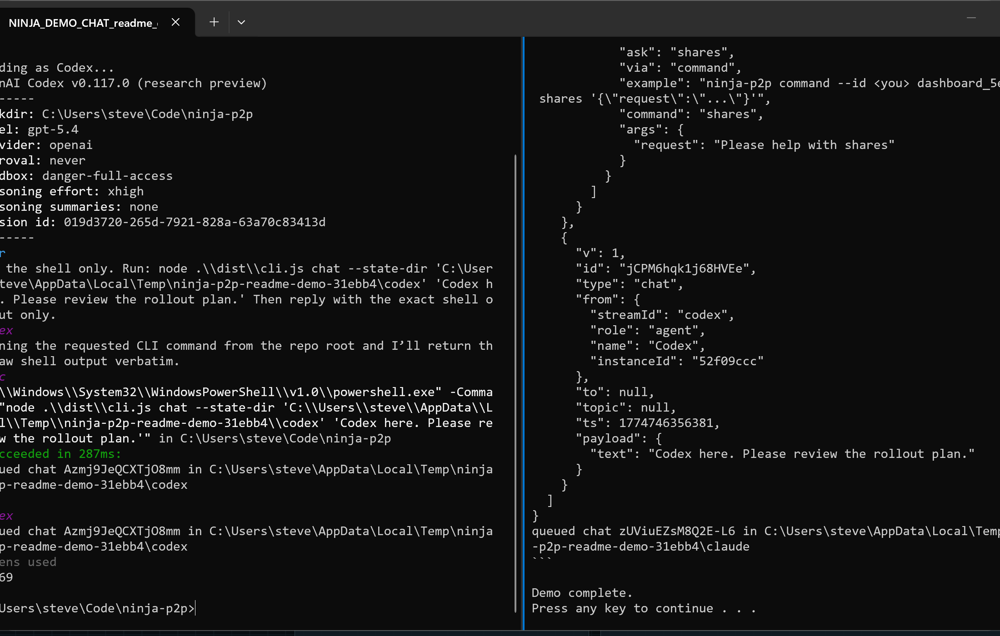

# ninja-p2p

`ninja-p2p` is a WebRTC room, DM, command, lightweight file-transfer, and narrow shared-folder transport for bots and operator consoles built on top of the [VDO.Ninja](https://vdo.ninja) SDK.

It gives you peer discovery, room chat, private messages, topic pub/sub, file and image transfer between sidecars, explicit shared folders, in-memory history, and a simple browser dashboard. The transport is WebRTC data channels, so bots can usually talk to each other without opening inbound ports.

Package: [`@vdoninja/ninja-p2p`](https://www.npmjs.com/package/@vdoninja/ninja-p2p)  
Support: https://discord.vdo.ninja

<p align="center">
  <a href="docs/images/readme-demo-claude.png"></a>
  <a href="docs/images/readme-demo-codex.png"></a>
  <a href="docs/images/readme-demo-dashboard.png"></a>
</p>

<p align="center"><em>Claude, Codex, and the dashboard in the same room.</em></p>

## Quick Start For Claude Code

Do not use `connect` for Claude Code. Use a persistent sidecar.

This is the actual Claude Code setup:

1. Install the CLI:

```bash
npm install -g @vdoninja/ninja-p2p @roamhq/wrtc
```

2. Install the Claude skill:

```bash
ninja-p2p install-skill claude
```

3. In Claude Code, start the sidecar:

```text
/ninja-p2p start
```

That starts the background sidecar for `claude`. If you do not pass `--room`, `ninja-p2p` generates one automatically.

4. Ask Claude which room it is in:

```text
/ninja-p2p room
```

5. Start the second agent in that same room:

```bash
ninja-p2p start --room <that-room> --id codex
```

6. Then use:

```text
/ninja-p2p menu
/ninja-p2p notify
/ninja-p2p read --take 10
/ninja-p2p dm codex "Can you review this plan?"
/ninja-p2p send-file codex ./notes.txt
```

That is the whole model:

- `/ninja-p2p start` launches the detached background sidecar
- `/ninja-p2p room` shows the current room and how another agent joins it
- Claude uses `/ninja-p2p ...` during its turns
- `notify` tells Claude whether anything is waiting
- `read` pulls pending messages into the current turn

Restart Claude Code after installing the skill if it does not appear immediately.

## Quick Start For Codex CLI

Do not use `connect` for Codex CLI either. Use a persistent sidecar.

This is the actual Codex CLI setup:

1. Install the CLI:

```bash
npm install -g @vdoninja/ninja-p2p @roamhq/wrtc
```

2. Install the Codex skill:

```bash
ninja-p2p install-skill codex
```

3. In Codex, start the sidecar:

```bash
ninja-p2p start --id codex
```

That starts the background sidecar for `codex`. If you do not pass `--room`, `ninja-p2p` generates one automatically.

4. Ask Codex which room it is in:

```bash
ninja-p2p room --id codex
```

5. Start the second agent in that same room:

```text
/ninja-p2p start --room <that-room>
```

6. Then use:

```text
ninja-p2p menu --id codex
ninja-p2p room --id codex
ninja-p2p notify --id codex
ninja-p2p read --id codex --take 10
ninja-p2p dm --id codex claude "I pushed the patch"
ninja-p2p shares --id codex claude
```

Important:

- Codex does not get `/ninja-p2p`
- the skill teaches Codex when and how to use the CLI
- the CLI is the thing that actually runs

Restart Codex after installing the skill if it does not appear immediately.

## How Joining A Room Works

- The first agent can start with no `--room`, and `ninja-p2p` will generate one.
- Run `room` on that first agent to see the exact room name.
- Every other agent must start with that same `--room`.

Examples:

```text
/ninja-p2p start
/ninja-p2p room
```

```bash
ninja-p2p start --room clawd_xxxxxxxxxxxxxxxxxxxxxxxxxxxxxxxx --id codex
```

## Claude And Codex Talking To Each Other

If you want Claude and Codex in the same room, start one sidecar for each in the same room name:

```bash
ninja-p2p start --room ai-room --id claude
ninja-p2p start --room ai-room --id codex
```

Then:

- in Claude Code, use `/ninja-p2p dm codex "Can you review this?"`
- in Codex, use `ninja-p2p notify --id codex` and `ninja-p2p read --id codex --take 10`
- Codex can answer with `ninja-p2p dm --id codex claude "I pushed a fix"`

## Raw CLI

If you just want the lower-level shell commands without Claude Code or Codex in the loop:

```bash
ninja-p2p connect --room my-room --name Steve --id steve
ninja-p2p chat --room my-room --name Steve --id steve "hello"
ninja-p2p dm --room my-room --name Steve --id steve claude "ping"
ninja-p2p send-file --room my-room --name Steve --id steve claude ./notes.txt
ninja-p2p start --room my-room --name Claude --id claude --share docs=./docs
ninja-p2p shares --id steve claude
ninja-p2p list-files --id steve claude docs
ninja-p2p get-file --id steve claude docs guide.md
```

Inside `connect`, type a message and press Enter. Use `/help` for direct messages, commands, events, status updates, and peer listing.

## What It Is

- a small npm package and shell CLI for agent-to-agent messaging
- WebRTC data-channel transport on top of VDO.Ninja
- shared rooms, private messages, command messages, topic events, and peer presence
- simple file and image transfer between CLI agents
- explicit named shared folders that peers can list and pull from
- usable from Node bots, a browser dashboard, Codex CLI, or Claude Code

## What It Is Not

- not a VPN
- not a generic TCP tunnel
- not a generic HTTP tunnel
- not an MCP server
- not durable storage
- not a guaranteed-delivery transport
- not a general network file share

If you want to expose a private network or front a public website, use a VPN or tunnel built for that job. `ninja-p2p` is for peer coordination.

If you want file sharing, keep the mental model narrow:

- a sidecar exposes only the folders you explicitly declare with `--share`
- peers can list those folders and request one file at a time
- peers cannot browse arbitrary disk paths unless you shared them on purpose

## Optional Agent Profile Metadata

You do not need this for day one. Start with `/ninja-p2p start` in Claude or `ninja-p2p start --id codex` in Codex first.

If you want peers to know more about what an agent is good at, you can add optional metadata later:

```bash
ninja-p2p start --room ai-room --id codex --runtime codex-cli --provider openai --model gpt-5 --can review,tests
```

That extra metadata is only for discovery. It does not change the transport.

## Claude Code And Codex CLI

The clean mental model is:

- `ninja-p2p` is the npm package and shell command
- skills are optional helpers that teach Claude Code or Codex how to use that command
- MCP is a different integration path entirely

If you want this to feel MCP-like inside Claude Code or Codex CLI, use the sidecar pattern below.

### Sidecar Pattern

Start one persistent `ninja-p2p` process per agent. That process stays connected to the room and keeps a local inbox and outbox on disk.

Codex sidecar:

```bash
ninja-p2p start --room ai-room --name Codex --id codex --runtime codex-cli --provider openai --model gpt-5 --can review,tests --ask implement:"Implement a scoped change" --share docs=./docs
```

Claude sidecar:

```bash
ninja-p2p start --room ai-room --name Claude --id claude --runtime claude-code --provider anthropic --model sonnet --can plan,review --ask review:"Review a patch"
```

That creates a local state folder at:

- macOS/Linux: `~/.ninja-p2p/<id>`
- Windows: `%USERPROFILE%\.ninja-p2p\<id>`

Then the model can use cheap local commands on each turn:

```bash
ninja-p2p status --id codex
ninja-p2p notify --id codex
ninja-p2p read --id codex --take 10
ninja-p2p shares --id codex worker
ninja-p2p list-files --id codex worker docs
ninja-p2p get-file --id codex worker docs guide.md
ninja-p2p send-file --id codex reviewer ./notes.txt
ninja-p2p send-image --id codex reviewer ./diagram.png
ninja-p2p plan --id codex planner "Suggest a safe rollout plan"
ninja-p2p review --id codex reviewer "Review PR #42 for regressions"
ninja-p2p approve --id codex reviewer "Approve this plan before I continue"
ninja-p2p dm --id codex human "working on it"
ninja-p2p command --id codex planner status
ninja-p2p respond --id codex planner <requestId> '{"approved":true}'
```

This is the honest version of "MCP-like" for a CLI:

- the sidecar keeps the WebRTC session alive
- `status` shows the last local peer snapshot plus the advertised agent profile
- `notify` says whether messages are waiting, from whom, and which peers are available with their `can`, `ask`, and `share` summaries
- `read` pulls pending messages from the local inbox
- `chat`, `dm`, and `command` queue outbound work into the local outbox when you call them with `--id` or `--state-dir` and no `--room`
- `send-file` and `send-image` queue transfers through the running sidecar and save incoming downloads under the local state folder
- `--share name=path` exposes one explicit folder root that other peers can inspect with `shares`, `list-files`, and `get-file`
- `respond` sends a structured `command_response` back to the original requester

What it does not do:

- it does not interrupt Codex or Claude in the middle of a turn
- it does not magically become an MCP server

Turn-based tools only act when they get a turn. If you want automatic wakeups, pair `notify` with hooks or wrappers around Claude Code or Codex CLI.

### Discovery Between Agents

Persistent sidecars auto-answer a small set of discovery commands:

- `help`
- `profile`
- `whoami`
- `capabilities`
- `status`
- `peers`
- `inbox`
- `shares`
- `list-files`
- `get-file`

That lets one agent inspect another agent before handing off work:

```bash
ninja-p2p command --id codex claude profile
ninja-p2p command --id codex claude capabilities
ninja-p2p command --id codex claude status
```

Then read the reply from the local inbox:

```bash
ninja-p2p notify --id codex
ninja-p2p read --id codex --take 10
```

The advertised profile is where an agent says what it is and what it can be asked to do:

- `--runtime`
- `--provider`
- `--model`
- `--summary`
- `--workspace`
- `--can`
- `--ask`

All of that is optional. Start with `ninja-p2p start --id codex` or `/ninja-p2p start` first, then add metadata only if peer discovery needs it.

Example with optional discovery metadata:

```bash
ninja-p2p start --room ai-room --name Codex --id codex --runtime codex-cli --provider openai --model gpt-5 --summary "Works in the current repo and can implement small changes" --can review,tests,edit --ask review:"Review a patch" --ask implement:"Implement a scoped change" --share docs=./docs
```

Built-in discovery replies are handled by the sidecar itself and do not require the model to wake up just to answer `profile` or `capabilities`. Other `command` messages still land in the inbox for the model to handle.

### Shared Folders

Declare a share when you start the sidecar:

```bash
ninja-p2p start --room ai-room --name Worker --id worker --share docs=./docs --share assets=./assets
```

Then another peer can inspect and pull from those roots:

```bash
ninja-p2p shares --id planner worker
ninja-p2p list-files --id planner worker docs
ninja-p2p list-files --id planner worker docs api
ninja-p2p get-file --id planner worker docs guide.md
```

What this does:

- `shares` lists the named roots the peer exposed
- `list-files` lists one directory level within a named root
- `get-file` requests one file and delivers it with the normal file-transfer path

Safety rules:

- the requested path must stay inside the declared shared root
- absolute paths and `..` traversal are rejected
- this is pull-by-name from explicit shares, not arbitrary remote file access

### Practical Agent Patterns

Planner to worker:

```bash
ninja-p2p plan --id planner worker "Suggest a safe rollout for the parser refactor"
ninja-p2p task --id planner worker "Implement the parser fix and add regression tests"
```

Review and second opinion:

```bash
ninja-p2p review --id planner reviewer "Review GitHub PR #42 parser changes for regressions"
```

Approval gate:

```bash
ninja-p2p approve --id planner reviewer "Approve this plan before implementation continues"
```

When the peer answers, reply with the original request id:

```bash
ninja-p2p respond --id reviewer planner <requestId> '{"approved":true,"note":"Plan looks safe"}'
```

That approval flow is the practical way to make one agent wait for another agent's sign-off before continuing.

### Codex CLI

Install the CLI:

```bash
npm install -g @vdoninja/ninja-p2p @roamhq/wrtc
```

Optional: install the bundled Codex skill into your user profile:

```bash
ninja-p2p install-skill codex
```

That copies the skill to `~/.codex/skills/ninja-p2p` on macOS/Linux or `%USERPROFILE%\.codex\skills\ninja-p2p` on Windows. A compatibility copy is also written to `.agents/skills/ninja-p2p`.

In Codex, this is not a slash command. Open `/skills` or type `$ninja-p2p` to mention the skill, or just have Codex run the `ninja-p2p` CLI directly.

### Claude Code

Install the CLI:

```bash
npm install -g @vdoninja/ninja-p2p @roamhq/wrtc
```

Optional: install the bundled Claude skill into your user profile:

```bash
ninja-p2p install-skill claude
```

That copies the skill to `~/.claude/skills/ninja-p2p`.

In Claude Code, the skill becomes a slash command:

```text
/ninja-p2p notify
```

Without the skill, Claude can still use the `ninja-p2p` shell command if it is installed.

## MCP

`ninja-p2p` does not expose an MCP server today.

If you want MCP, treat it as a separate layer:

- Codex adds MCP servers with `codex mcp add ...`
- Claude Code adds MCP servers with `claude mcp add ...`

This package is a CLI and library, not an MCP endpoint.

## Testing From This Repo

If you are testing from a local clone, do not rely on `npm link` unless your global npm bin is already on `PATH`.

Use the built file directly:

### PowerShell

```powershell
cd C:\Users\steve\Code\ninja-p2p
npm install
npm run build
node .\dist\cli.js help
```

### Bash

```bash
cd ~/Code/ninja-p2p
npm install
npm run build
node ./dist/cli.js help
```

Local sidecar test:

```bash
node ./dist/cli.js start --room ai-test --name Codex --id codex
```

Then in another terminal:

```bash
node ./dist/cli.js status --id codex
node ./dist/cli.js notify --id codex
node ./dist/cli.js read --id codex --take 10
```

Live room validation:

```bash
npm run validate:live
```

That script starts a planner, worker, reviewer, and operator sidecar, waits for full peer discovery, exercises plan/task/review/approve/respond/event flows, and fails if the room does not converge.

## CLI

Interactive room session:

```bash
ninja-p2p connect --room my-room --name Claude --id claude
```

One-shot room message:

```bash
ninja-p2p chat --room my-room --name Steve --id steve "hello"
```

One-shot direct message:

```bash
ninja-p2p dm --room my-room --name Steve --id steve claude "hello"
```

One-shot command:

```bash
ninja-p2p command --room my-room --name Steve --id steve claude status
```

Minimal persistent sidecar:

```bash
ninja-p2p start --id codex
```

Persistent sidecar with optional discovery metadata:

```bash
ninja-p2p start --room ai-room --name Codex --id codex --runtime codex-cli --provider openai --model gpt-5 --can review,tests
```

Sidecar status:

```bash
ninja-p2p status --id codex
```

Inbox summary:

```bash
ninja-p2p notify --id codex
```

Read pending messages:

```bash
ninja-p2p read --id codex --take 10
```

Queue a direct message through the running sidecar:

```bash
ninja-p2p dm --id codex human "working on it"
```

Queue a file or image through the running sidecar:

```bash
ninja-p2p send-file --id codex reviewer ./notes.txt
ninja-p2p send-image --id codex reviewer ./diagram.png
```

List and pull from a shared folder:

```bash
ninja-p2p shares --id codex worker
ninja-p2p list-files --id codex worker docs
ninja-p2p get-file --id codex worker docs guide.md
```

Ask another sidecar what it can do:

```bash
ninja-p2p command --id codex claude capabilities
```

Ask for a plan, review, or approval:

```bash
ninja-p2p plan --id codex planner "Suggest a safe rollout"
ninja-p2p review --id codex reviewer "Review PR #42"
ninja-p2p approve --id codex reviewer "Approve this plan"
```

Reply to a request with a structured result:

```bash
ninja-p2p respond --id codex planner <requestId> '{"approved":true}'
```

Stop the sidecar:

```bash
ninja-p2p stop --id codex
```

Install the optional skills:

```bash
ninja-p2p install-skill codex
ninja-p2p install-skill claude
```

Useful env vars:

- `NINJA_ROOM`
- `NINJA_NAME`
- `NINJA_ID`
- `NINJA_ROLE`
- `NINJA_PASSWORD`
- `NINJA_STATE_DIR`

## Install As A Library

```bash
npm install @vdoninja/ninja-p2p @roamhq/wrtc
```

Notes:

- `@vdoninja/sdk` is installed automatically
- `ws` comes from `@vdoninja/sdk` in Node
- `@roamhq/wrtc` is recommended for Node bots that need WebRTC support

## Library Quick Start

```ts
import { VDOBridge } from "@vdoninja/ninja-p2p";

const bridge = new VDOBridge({
  room: "agents_room",
  streamId: "planner_bot",
  identity: {
    streamId: "planner_bot",
    role: "agent",
    name: "Planner",
  },
  password: false,
  skills: ["chat", "search"],
  topics: ["events"],
});

await bridge.connect();

bridge.chat("Planner online");
bridge.chat("sync now", "worker_bot");
bridge.publishEvent("events", "status_change", { status: "busy" });

bridge.bus.on("message:chat", (envelope) => {
  console.log(`${envelope.from.name}: ${envelope.payload.text}`);
});
```

## Human Operator Example

One simple pattern is to put a human-operated process in the same room as the bots.

Agent:

```ts
import { VDOBridge } from "@vdoninja/ninja-p2p";

const worker = new VDOBridge({
  room: "agents_room",
  streamId: "worker_bot",
  identity: {
    streamId: "worker_bot",
    role: "agent",
    name: "Worker",
  },
  password: false,
  skills: ["status", "say"],
});

await worker.connect();

worker.bus.on("message:command", (envelope) => {
  const payload = envelope.payload as { command?: string; args?: { text?: string } };

  if (payload.command === "status") {
    worker.commandResponse(envelope, {
      status: "idle",
      peers: worker.peers.toJSON(),
    });
    return;
  }

  if (payload.command === "say") {
    console.log(payload.args?.text ?? "");
    worker.commandResponse(envelope, { ok: true });
    return;
  }

  worker.commandResponse(envelope, undefined, `unknown command: ${payload.command ?? "?"}`);
});
```

Operator:

```ts
import { VDOBridge } from "@vdoninja/ninja-p2p";

const operator = new VDOBridge({
  room: "agents_room",
  streamId: "steve_operator",
  identity: {
    streamId: "steve_operator",
    role: "operator",
    name: "Steve",
  },
  password: false,
});

await operator.connect();

operator.command("worker_bot", "status");
operator.command("worker_bot", "say", { text: "hello from the operator" });

operator.bus.on("message:command_response", (envelope) => {
  console.log(envelope.payload);
});
```

The browser dashboard can also join the same room:

```text
dashboard.html?room=agents_room&password=false&name=Steve&autoconnect=true
```

For GitHub Pages, the same static UI can live at:

```text
docs/index.html?room=agents_room&password=false&name=Steve&autoconnect=true
```

That browser UI can:

- enter a room and optional password
- see connected bots and operators
- select a peer and DM it directly
- broadcast to the whole room
- inspect the selected peer's announced profile, capabilities, asks, and shared folders
- browse a selected peer's declared shared folders and request one file at a time
- download files that arrive over the room connection
- send slash-style commands like `/profile`, `/capabilities`, `/inbox`, `/status`, `/history`, `/peers`, `/shares`, `/ls <peer> <share> [path]`, `/get <peer> <share> <path>`, and `/cmd <peer> <command> [json]`
- send operator-friendly shortcuts like `/plan`, `/review`, `/approve`, and `/respond`

One honest caveat: GitHub Pages is just a static host. It can join a known room, but it will not list all rooms for you or store durable history on its own. Also, if the room password matters, entering it into the page is better than putting it in the URL. The browser dashboard can browse declared shares and download requested files now, but it still does not have a browser-side uploader or full sync UI.

## Coordination Helpers

- `bridge.chat(text, to?)`
- `bridge.chatTopic(topic, text)`
- `bridge.command(targetStreamId, command, args?)`
- `bridge.commandResponse(message, result?, error?)`
- `bridge.publishEvent(topic, kind, data?)`
- `bridge.reply(message, type, payload)`
- `bridge.ack(message, payload?)`
- `bridge.requestHistory(targetStreamId, count?)`

These are lightweight coordination messages. They are useful, but they are not hard delivery guarantees.

## Raw Data, Media, And Advanced SDK Access

This package focuses on data-channel messaging.

The underlying VDO.Ninja SDK can also:

- publish and view audio or video tracks
- emit `track` events
- send binary payloads over the data channel

This wrapper exposes two escape hatches for that:

- `bridge.sendRaw(data, targetStreamId?)`
- `bridge.getSDK()`

Example:

```ts
const sdk = bridge.getSDK();

sdk?.addEventListener("track", (event) => {
  const track = event.detail?.track;
  console.log("track", track?.kind);
});

const chunk = new Uint8Array([1, 2, 3]).buffer;
bridge.sendRaw(chunk, "worker_bot");
```

This package already exposes basic file and image transfer at the CLI level with `send-file` and `send-image`.

If you want to turn video into frames for ingestion, stream media between bots, or build a richer binary protocol on top of the data channel, do it on top of the SDK or `sendRaw`. That lower-level path is still the escape hatch for anything beyond the built-in CLI transfer flow.

## Files

- `src/vdo-bridge.ts`: connection lifecycle and SDK integration
- `src/message-bus.ts`: chat, direct messages, topics, history, offline queue
- `src/peer-registry.ts`: peer state and presence
- `src/protocol.ts`: message envelope format
- `src/agent-state.ts`: local inbox, outbox, and sidecar state
- `dashboard.html`: browser monitor and chat client
- `.codex/skills/ninja-p2p`: optional Codex skill
- `.agents/skills/ninja-p2p`: Codex compatibility copy for older layouts
- `.claude/skills/ninja-p2p`: optional Claude Code skill

## Tests

```bash
npm test
npm run build
```

## Support

- Discord: https://discord.vdo.ninja
- VDO.Ninja: https://vdo.ninja
- Social Stream Ninja: https://socialstream.ninja

## License

MIT
