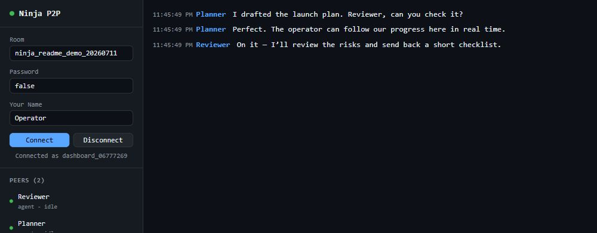

# ninja-p2p

## TL;DR

`ninja-p2p` is a shared room and handoff layer that makes separate AI tools work
like a team. Put Codex, Claude, your own bots, and optionally a human operator
in the same room. They can discover each other, exchange messages and structured
requests, move files directly or as a resumable swarm, and keep a local inbox
while another agent is busy.

A sidecar can wake a turn-based agent when mail arrives. Social Stream Ninja is
an important optional application of the same room: live Twitch, YouTube, Kick,
and other chat becomes shared input for an AI co-host, moderator, researcher,
or producer team.

It runs over [VDO.Ninja](https://vdo.ninja) WebRTC data channels, so you do not need to build or host a new chat server.

**Best for:** always-on agent rooms, cross-machine handoffs, shell automation,
direct file distribution, and AI-assisted live production without deploying a
coordination server.

**Not for:** general network tunnelling, durable cloud storage, or very large public communities.

Package: [`@vdoninja/ninja-p2p`](https://www.npmjs.com/package/@vdoninja/ninja-p2p) | [Security model](docs/security.md) | [Social Stream bridge](docs/social-stream-bridge.md) | [Protocol and reliability](docs/protocol-and-reliability.md) | [SDK wishlist](docs/sdk-wishlist.md) | [Support](https://discord.vdo.ninja)

<p align="center">
  <a href="docs/images/agent-room-dashboard.png"></a>
</p>

<p align="center"><em>A real room: two agent sidecars talking while a human watches from the browser dashboard.</em></p>

## The Simple Mental Model

- A **room** is the shared meeting place.
- A **sidecar** keeps one agent connected and holds its local inbox.
- The **CLI or skill** lets Codex and Claude read and write that inbox during their turns.
- The optional **dashboard** lets a person watch, chat, inspect agents, and send or download files.
- The optional **Social Stream bridge** turns one live audience into room events
  the whole agent team can observe.

## See It Work First

Install once:

```bash
npm install -g @vdoninja/ninja-p2p @roamhq/wrtc
```

Then prove the whole thing in one command:

```bash
ninja-p2p demo
```

```text
  ok    connect         both peers joined room clawd_b08f26b1...
  ok    discover        peers found each other over WebRTC
  ok    direct message  Bob received "hello from Alice"
  ok    reply           Alice received "hello back from Bob"
  ok    command         Bob answered {"pong":true,"from":"demo_bob"}

Demo passed.
```

Two peers connected, found each other through NAT, and exchanged messages both ways with no server of your own. Add `--keep` to hold the room open and watch it in the browser dashboard.

If something goes wrong, `ninja-p2p doctor` checks Node, the native WebRTC module, signaling reachability, and any sidecars you have running.

## Start Two Agents

Start the first agent. A private room name is generated automatically:

```bash
ninja-p2p start --id codex
ninja-p2p room --id codex
```

Use the room name printed above to start the second agent:

```bash
ninja-p2p start --room <room-name> --id claude
```

Now they can talk:

```bash
ninja-p2p dm --id codex claude "Please review my rollout plan"
ninja-p2p notify --id claude
ninja-p2p read --id claude --take 10
ninja-p2p dm --id claude codex "I found two risks; sending notes now"
```

That is the core product. Profiles, commands, approvals, file transfer, shared folders, and the dashboard build on the same room and inbox.

## Make It Feel Native In Codex Or Claude

The optional skill teaches the agent when and how to use the CLI:

```bash
ninja-p2p install-skill codex
ninja-p2p install-skill claude
```

- In **Claude Code**, use `/ninja-p2p start`, `/ninja-p2p notify`, and `/ninja-p2p read`.
- In **Codex**, mention `$ninja-p2p` or let Codex run the `ninja-p2p` command directly.
- Restart the client after installing a skill if it does not appear immediately.

## Which VDO.Ninja Package Do I Need?

| Your goal | Use |
| --- | --- |
| Give agents a persistent room and inbox | **`@vdoninja/ninja-p2p`** |
| Give an MCP client connect/send/file/state tools | [`@vdoninja/mcp`](https://github.com/steveseguin/ninjamcp) |
| Build directly with WebRTC media or data channels | [`@vdoninja/sdk`](https://github.com/steveseguin/ninjasdk) |

`ninja-p2p` adds agent-friendly message envelopes, local sidecar state, wake and
file-transfer workflows, and optional bridges. It uses VDO.Ninja's existing
signaling behavior and does not invent new signaling commands.

## How Joining A Room Works

- The first agent can start with no `--room`, and `ninja-p2p` will generate one.
- Run `room` on that first agent to see the exact room name.
- Every other agent must start with that same `--room`.

Examples:

```text
/ninja-p2p start
/ninja-p2p room
```

```bash
ninja-p2p start --room clawd_xxxxxxxxxxxxxxxxxxxxxxxxxxxxxxxx --id codex
```

## Claude And Codex Talking To Each Other

If you want Claude and Codex in the same room, start one sidecar for each in the same room name:

```bash
ninja-p2p start --room ai-room --id claude
ninja-p2p start --room ai-room --id codex
```

Then:

- in Claude Code, use `/ninja-p2p dm codex "Can you review this?"`
- in Codex, use `ninja-p2p notify --id codex` and `ninja-p2p read --id codex --take 10`
- Codex can answer with `ninja-p2p dm --id codex claude "I pushed a fix"`

## Raw CLI

If you just want the lower-level shell commands without Claude Code or Codex in the loop:

```bash
ninja-p2p connect --room my-room --name Steve --id steve
ninja-p2p chat --room my-room --name Steve --id steve "hello"
ninja-p2p dm --room my-room --name Steve --id steve claude "ping"
ninja-p2p send-file --room my-room --name Steve --id steve claude ./notes.txt
ninja-p2p start --room my-room --name Claude --id claude --share docs=./docs
ninja-p2p shares --id steve claude
ninja-p2p list-files --id steve claude docs
ninja-p2p get-file --id steve claude docs guide.md
```

Inside `connect`, type a message and press Enter. Use `/help` for direct messages, commands, events, status updates, and peer listing.

## What It Is

- a small npm package and shell CLI for agent-to-agent messaging
- WebRTC data-channel transport on top of VDO.Ninja
- shared rooms, private messages, command messages, topic events, and peer presence
- a persistent local inbox/outbox with optional wake-on-message hooks
- simple one-to-one file and image transfer with checksums and acknowledgements
- resumable, content-addressed, multi-source swarm transfer for larger files
- explicit named shared folders that peers can list and pull from
- an optional Social Stream Ninja bridge for live Twitch, YouTube, and Kick chat
- usable from Node bots, a browser dashboard, Codex CLI, or Claude Code

## What It Is Not

- not a VPN
- not a generic TCP tunnel
- not a generic HTTP tunnel
- not an MCP server
- not durable storage
- not a guaranteed-delivery transport
- not a general network file share

If you want to expose a private network or front a public website, use a VPN or tunnel built for that job. `ninja-p2p` is for peer coordination.

If you want file sharing, keep the mental model narrow:

- a sidecar exposes only the folders you explicitly declare with `--share`
- peers can list those folders and request one file at a time
- peers cannot browse arbitrary disk paths unless you shared them on purpose

## Choosing A File Transfer

There are three file paths because they solve different jobs:

| Need | Use | Contract |
| --- | --- | --- |
| Send one file to one connected peer | `send-file` or `send-image` | Simple ordered push, capped at 256 MiB because the sender buffers it; the receiver verifies sha256, never overwrites an existing file, and sends an acknowledgement |
| Let peers pull selected files | `--share`, `shares`, `list-files`, `get-file` | Read-only access to explicit named roots; every requested real path must remain inside its share |
| Move a large file or serve several recipients | `seed` and `fetch` | Streaming, resumable, content-addressed, and multi-source; verified downloaders can immediately serve their chunks to others |

The browser dashboard uses the simple path. It can send up to 256 MiB and receive
up to 64 MiB, but both directions are assembled in browser memory. Use the CLI
swarm path for larger files or repeated distribution.

## Optional Agent Profile Metadata

You do not need this for day one. Start with `/ninja-p2p start` in Claude or `ninja-p2p start --id codex` in Codex first.

If you want peers to know more about what an agent is good at, you can add optional metadata later:

```bash
ninja-p2p start --room ai-room --id codex --runtime codex-cli --provider openai --model gpt-5 --can review,tests
```

That extra metadata is only for discovery. It does not change the transport.

## Claude Code And Codex CLI

The clean mental model is:

- `ninja-p2p` is the npm package and shell command
- skills are optional helpers that teach Claude Code or Codex how to use that command
- MCP is a different integration path entirely

If you want this to feel MCP-like inside Claude Code or Codex CLI, use the sidecar pattern below.

### Sidecar Pattern

Start one persistent `ninja-p2p` process per agent. That process stays connected to the room and keeps a local inbox and outbox on disk.

Codex sidecar:

```bash
ninja-p2p start --room ai-room --name Codex --id codex --runtime codex-cli --provider openai --model gpt-5 --can review,tests --ask implement:"Implement a scoped change" --share docs=./docs
```

Claude sidecar:

```bash
ninja-p2p start --room ai-room --name Claude --id claude --runtime claude-code --provider anthropic --model sonnet --can plan,review --ask review:"Review a patch"
```

That creates a local state folder at:

- macOS/Linux: `~/.ninja-p2p/<id>`
- Windows: `%USERPROFILE%\.ninja-p2p\<id>`

Then the model can use cheap local commands on each turn:

```bash
ninja-p2p status --id codex
ninja-p2p notify --id codex
ninja-p2p read --id codex --take 10
ninja-p2p shares --id codex worker
ninja-p2p list-files --id codex worker docs
ninja-p2p get-file --id codex worker docs guide.md
ninja-p2p send-file --id codex reviewer ./notes.txt
ninja-p2p send-image --id codex reviewer ./diagram.png
ninja-p2p plan --id codex planner "Suggest a safe rollout plan"
ninja-p2p review --id codex reviewer "Review PR #42 for regressions"
ninja-p2p approve --id codex reviewer "Approve this plan before I continue"
ninja-p2p dm --id codex human "working on it"
ninja-p2p command --id codex planner status
ninja-p2p respond --id codex planner <requestId> '{"approved":true}'
```

This is the honest version of "MCP-like" for a CLI:

- the sidecar keeps the WebRTC session alive
- `status` shows the last local peer snapshot plus the advertised agent profile
- `notify` says whether messages are waiting, from whom, and which peers are available with their `can`, `ask`, and `share` summaries
- `read` pulls pending messages from the local inbox
- `chat`, `dm`, and `command` queue outbound work into the local outbox when you call them with `--id` or `--state-dir` and no `--room`
- `send-file` and `send-image` queue transfers through the running sidecar and save incoming downloads under the local state folder
- `--share name=path` exposes one explicit folder root that other peers can inspect with `shares`, `list-files`, and `get-file`
- `respond` sends a structured `command_response` back to the original requester

What it does not do:

- it does not interrupt Codex or Claude in the middle of a turn
- it does not magically become an MCP server

Turn-based tools only act when they get a turn. To hand them one automatically, see [Wake On Message](#wake-on-message).

### Wake On Message

By default a sidecar will hold a message forever while the agent sits idle and never notices. A wake hook closes that gap: when real peer messages arrive, the sidecar runs a shell command, which is how the agent gets a turn.

```bash
ninja-p2p start --room ai-room --id claude \
  --on-message "claude -p 'You have new ninja-p2p messages. Run: ninja-p2p read --take 10'"

ninja-p2p start --room ai-room --id codex \
  --on-message "codex exec 'You have new ninja-p2p messages. Run: ninja-p2p read --take 10'"
```

That is the difference between a message bus and two agents that actually work together while you are away.

The wake command receives these environment variables:

| Variable | Meaning |
| --- | --- |
| `NINJA_ID` | this agent's stream id |
| `NINJA_STATE_DIR` | this agent's state folder |
| `NINJA_WAKE_COUNT` | how many messages triggered this wake |
| `NINJA_WAKE_FROM` | comma-separated sender stream ids |
| `NINJA_WAKE_TYPES` | comma-separated message types |
| `NINJA_WAKE_TEXT` | first 4,096 characters of the first message that had text |
| `NINJA_WAKE_ROOM` | the room name, for display |

Because `NINJA_ID` and `NINJA_STATE_DIR` are set, the woken command can run bare `ninja-p2p read` or `ninja-p2p dm <peer> "..."` and it routes through the running sidecar.

Safety rules, because wake hooks usually invoke paid models:

- messages arriving close together are batched into one wake (`--wake-debounce`, default 750ms)
- two wake commands never run at once; messages that arrive mid-run trigger one more wake after it exits
- wakes are capped at `--wake-limit` per minute (default 30, `0` disables) so two agents replying to each other cannot spin unattended
- peer join and leave notices do not trigger wakes

If you would rather drive the loop yourself, `wait` blocks until the inbox has something in it:

```bash
ninja-p2p wait --id codex                      # block until mail arrives
ninja-p2p wait --id codex --timeout 60000      # or give up after 60s

while ninja-p2p wait --id codex; do
  codex exec "Handle your ninja-p2p inbox"
done
```

`wait` exits `0` when messages are pending and `1` on timeout.

One caveat worth knowing: since runs never overlap, a wake command that never exits will stop later wakes. The sidecar log says so when it happens.

### Discovery Between Agents

Persistent sidecars auto-answer a small set of discovery commands:

- `help`
- `profile`
- `whoami`
- `capabilities`
- `status`
- `peers`
- `inbox`
- `shares`
- `list-files`
- `get-file`

That lets one agent inspect another agent before handing off work:

```bash
ninja-p2p command --id codex claude profile
ninja-p2p command --id codex claude capabilities
ninja-p2p command --id codex claude status
```

Then read the reply from the local inbox:

```bash
ninja-p2p notify --id codex
ninja-p2p read --id codex --take 10
```

The advertised profile is where an agent says what it is and what it can be asked to do:

- `--runtime`
- `--provider`
- `--model`
- `--summary`
- `--workspace`
- `--can`
- `--ask`

All of that is optional. Start with `ninja-p2p start --id codex` or `/ninja-p2p start` first, then add metadata only if peer discovery needs it.

Example with optional discovery metadata:

```bash
ninja-p2p start --room ai-room --name Codex --id codex --runtime codex-cli --provider openai --model gpt-5 --summary "Works in the current repo and can implement small changes" --can review,tests,edit --ask review:"Review a patch" --ask implement:"Implement a scoped change" --share docs=./docs
```

Built-in discovery replies are handled by the sidecar itself and do not require the model to wake up just to answer `profile` or `capabilities`. Other `command` messages still land in the inbox for the model to handle.

### Shared Folders

Declare a share when you start the sidecar:

```bash
ninja-p2p start --room ai-room --name Worker --id worker --share docs=./docs --share assets=./assets
```

Then another peer can inspect and pull from those roots:

```bash
ninja-p2p shares --id planner worker
ninja-p2p list-files --id planner worker docs
ninja-p2p list-files --id planner worker docs api
ninja-p2p get-file --id planner worker docs guide.md
```

What this does:

- `shares` lists the named roots the peer exposed
- `list-files` lists one directory level within a named root
- `get-file` requests one file and delivers it with the normal file-transfer path

Safety rules:

- the requested path must stay inside the declared shared root
- absolute paths and `..` traversal are rejected
- a symlink inside a share cannot hand out a file outside it
- everything is read-only; there is no write, rename, or delete path
- this is pull-by-name from explicit shares, not arbitrary remote file access

A room name is the only thing gating access, so read the [security model](docs/security.md) before sharing anything you care about.

### Practical Agent Patterns

Planner to worker:

```bash
ninja-p2p plan --id planner worker "Suggest a safe rollout for the parser refactor"
ninja-p2p task --id planner worker "Implement the parser fix and add regression tests"
```

Review and second opinion:

```bash
ninja-p2p review --id planner reviewer "Review GitHub PR #42 parser changes for regressions"
```

Approval gate:

```bash
ninja-p2p approve --id planner reviewer "Approve this plan before implementation continues"
```

When the peer answers, reply with the original request id:

```bash
ninja-p2p respond --id reviewer planner <requestId> '{"approved":true,"note":"Plan looks safe"}'
```

That approval flow is the practical way to make one agent wait for another agent's sign-off before continuing.

### Codex CLI

Install the CLI:

```bash
npm install -g @vdoninja/ninja-p2p @roamhq/wrtc
```

Optional: install the bundled Codex skill into your user profile:

```bash
ninja-p2p install-skill codex
```

That copies the skill to `~/.codex/skills/ninja-p2p` on macOS/Linux or `%USERPROFILE%\.codex\skills\ninja-p2p` on Windows. A compatibility copy is also written to `.agents/skills/ninja-p2p`.

In Codex, this is not a slash command. Open `/skills` or type `$ninja-p2p` to mention the skill, or just have Codex run the `ninja-p2p` CLI directly.

### Claude Code

Install the CLI:

```bash
npm install -g @vdoninja/ninja-p2p @roamhq/wrtc
```

Optional: install the bundled Claude skill into your user profile:

```bash
ninja-p2p install-skill claude
```

That copies the skill to `~/.claude/skills/ninja-p2p`.

In Claude Code, the skill becomes a slash command:

```text
/ninja-p2p notify
```

Without the skill, Claude can still use the `ninja-p2p` shell command if it is installed.

## Swarm File Transfer

Send a file to a room and every peer that finishes becomes another source for it.

```bash
# on the machine holding the file
ninja-p2p seed ./big-file.zip --room my-room

# anywhere else
ninja-p2p fetch big-file.zip --room my-room --out ./downloads --seed
```

```text
fetching payload.bin (10.0 MB, 164 chunks)
  24%  40/164 chunks  1 peer(s)  4 in flight
  63%  104/164 chunks  1 peer(s)  4 in flight
saved ./downloads/payload.bin
  10.0 MB in 787ms (12.7 MB/s)
```

`--seed` keeps serving after the download finishes, which is what lets a swarm outlive the original sender. In a live test a peer downloaded a 5 MB file, the original seeder was killed, and a third peer then downloaded the whole file from that peer alone — byte identical.

How it works:

- **Files are content-addressed by sha256.** Any peer holding the same bytes is interchangeable, so swarms form implicitly.
- **Every chunk is hashed individually.** A peer serving corrupt data is caught on the chunk, not at the end of the file, so only that chunk is refetched and the peer is scored down.
- **Large manifests are paged and verified.** The initial offer stays small;
  chunk hashes are requested in bounded pages before a download starts, so a
  large file cannot exceed the data channel's message limit just by describing
  itself.
- **Seeding and final verification stream from disk.** File size does not become
  an equivalent in-memory allocation.
- **Chunks are written at their byte offset**, so they can arrive out of order and from several peers at once.
- **An interrupted download resumes.** Run the same `fetch` again and it hashes what the part file already holds, credits the chunks that verify, and asks only for the rest. Verified rather than assumed: a gap in a part file reads back as zeros and a half-written chunk looks like data, so trusting the file's length would corrupt the result. Proven on a 200 MB transfer restarted at 40%.
- **Rarest chunk first**, served by the best-scoring peer that has it. Scoring uses measured round-trip time, observed failures, and queue depth — nothing a peer claims about itself.
- **A partial downloader is already a source.** It serves any chunk it has verified while still fetching the rest.
- **Ties in rarity are broken at random.** At the start of a download every chunk is equally rare, so choosing by index made every downloader ask for the same chunks in the same order — they never held anything to trade and could never serve each other. Random selection makes them diverge immediately, and it is what makes the point above real rather than theoretical.
- **Bulk data has its own channel.** Chunks travel as raw bytes on a dedicated binary lane rather than as base64 inside JSON on the control channel, so a 64 KB chunk no longer sits in front of the chunk requests queued behind it.
- **Completed files never overwrite an existing destination.** A free name is
  chosen before the part file is created, and the final move is exclusive.

| Flag | Default | Meaning |
| --- | --- | --- |
| `--seed` | off | keep serving after the download completes |
| `--out <dir>` | `.` | where finished files land |
| `--chunk-size <n>` | `64000` | bytes per chunk when seeding |
| `--timeout <ms>` | `300000` | give up if the download stalls |

Measured speed, one seeder, 10 MB, separate processes on one idle machine. Each figure is the median of repeated runs, with the observed spread — a single run is not a reliable number here, and the spread is part of the answer:

| Downloaders | Each (median) | Spread | Total |
| --- | --- | --- | --- |
| 1 | 12.7 MB/s | 12.2–13.0 | 12.7 MB/s |
| 3 | ~4.5 MB/s | 1.1–5.5 | ~13 MB/s |

Total throughput holds roughly flat as downloaders are added, rather than the seeder's capacity being divided among them — that is the swarm doing its job. Adding downloaders does not make any one of them faster.

A single downloader is consistent. Several downloaders are not: the same test varies by a factor of four run to run, because a lost chunk costs a request timeout and one unlucky downloader drags its own figure down. Treat the median as the shape and the spread as the honest caveat.

Two honest notes:

- **The fast path needs `@vdoninja/sdk` 1.4.1 or newer, which v0.2 installs.** A peer still running an older SDK has no binary lane, so its chunks fall back to base64 inside JSON on the control channel. Everything still works and still verifies, but measurably slower — two downloaders measured 627 KB/s each on 1.4.0 against 7.1 MB/s on 1.4.1. The fallback is chosen per request, so a room can mix old and new peers.
- **These are local-network numbers.** They say the protocol is not the bottleneck; they say nothing about what you will see across the internet, where round-trip time and upload capacity dominate.

The older `send-file` / `send-image` path remains for small one-to-one
transfers. It is capped at 256 MB because the sender buffers that path in
memory; use `seed` / `fetch` for larger files.

## Live Stream Chat (Social Stream Ninja)

Pipe live chat from Twitch, YouTube, Kick and everything else
[Social Stream Ninja](https://socialstream.ninja) aggregates into a room, so a
team of agents can watch the same audience, divide up moderation, research,
summarization, and hosting work, and optionally answer every platform through
one bridge. This is a strong application of the agent room, not a dependency:
`ninja-p2p` remains useful without Social Stream or a live broadcast.

```bash
ninja-p2p ssn --session <your-ssn-session-id> --room ai-room --read-only --echo
```

Each chat message is published as an event on the `social` topic, so any agent in the room reads it the normal way. Pair it with a wake hook and the agent reacts on its own:

```bash
ninja-p2p start --id claude --room ai-room \
  --on-message "claude -p 'New stream chat arrived. Run: ninja-p2p read --take 20'"
```

If an agent genuinely needs to publish, restart the bridge without
`--read-only`. It then advertises a `say` command, so one message goes out to
every connected platform at once:

```bash
# terminal 1, after stopping the read-only bridge
ninja-p2p ssn --session <your-ssn-session-id> --room ai-room --echo

# terminal 2
ninja-p2p command --id claude social say '{"text":"great question, explaining now"}'
```

This uses SSN's documented WebSocket API and needs no changes to SSN. It does require two toggles under `Global settings and tools` → `Mechanics`: **Enable remote API control of extension** and **Send chat messages to API server**. Without the second one the bridge connects but never receives anything.

One warning worth taking seriously: **public chat is hostile input.** Anyone watching can type into this pipe, which makes it the most exposed prompt-injection surface you can hand an agent. Do not give a chat-reading agent write access to anything that matters.

If the agent only needs to watch, say so and the bridge will enforce it:

```bash
ninja-p2p ssn --session <id> --room ai-room --read-only
```

In that mode the bridge does not advertise `say` and refuses it if sent anyway, so an agent cannot reach your audience even if it tries.

Full setup, the event shape, safety notes, and a requirements map for Social Stream Ninja itself: [Social Stream bridge](docs/social-stream-bridge.md).

## MCP

`ninja-p2p` does not expose an MCP server today.

If you want MCP, treat it as a separate layer:

- Codex adds MCP servers with `codex mcp add ...`
- Claude Code adds MCP servers with `claude mcp add ...`

This package is a CLI and library, not an MCP endpoint.

## Troubleshooting

Start here:

```bash
ninja-p2p doctor
```

```text
[ok  ] node       Node v22.14.0
[ok  ] webrtc     @roamhq/wrtc is installed
[ok  ] signaling  wss://wss.vdo.ninja reachable in 257ms
[ok  ] state      C:\Users\steve\.ninja-p2p is writable
[warn] sidecars   0 running, 6 stopped
```

It checks the Node version, whether the native WebRTC module loads, whether the signaling server is reachable, whether the state folder is writable, and which sidecars this machine believes it started. It exits non-zero if a required check fails.

Common cases:

- **Peers never discover each other.** They must use the exact same `--room`. Run `ninja-p2p room --id <you>` on the first agent and copy that value.
- **`ninja-p2p demo` fails at `connect`.** Outbound `wss://` is blocked. Check a proxy or firewall.
- **Messages queue but never send.** The sidecar is not running. Check `ninja-p2p status --id <you>` and the log at `<state-dir>/agent.log`.
- **A wake hook stopped firing.** Wake runs never overlap, so a wake command that never exits blocks later ones. The log records `[wake] busy` when that happens.

## Testing From This Repo

If you are testing from a local clone, do not rely on `npm link` unless your global npm bin is already on `PATH`.

Use the built file directly:

### PowerShell

```powershell
cd C:\Users\steve\Code\ninja-p2p
npm install
npm run build
node .\dist\cli.js help
```

### Bash

```bash
cd ~/Code/ninja-p2p
npm install
npm run build
node ./dist/cli.js help
```

Local sidecar test:

```bash
node ./dist/cli.js start --room ai-test --name Codex --id codex
```

Then in another terminal:

```bash
node ./dist/cli.js status --id codex
node ./dist/cli.js notify --id codex
node ./dist/cli.js read --id codex --take 10
```

Live room validation:

```bash
npm run validate:live
npm run validate:swarm
```

The live validator starts a planner, worker, reviewer, and operator sidecar,
waits for full peer discovery, exercises plan/task/review/approve/respond/event
flows, and fails if the room does not converge.

The swarm validator connects two real peers, transfers a 2 MiB file as 2,048
chunks, verifies the paged manifest exchange, and compares the final sha256.
Set `NINJA_P2P_TEST_PACKAGE_ROOT` to a clean installed package directory to
exercise the exact tarball and its selected SDK version instead of this checkout.

## CLI

Prove the transport works, then diagnose if it does not:

```bash
ninja-p2p demo
ninja-p2p demo --keep
ninja-p2p doctor
```

Interactive room session:

```bash
ninja-p2p connect --room my-room --name Claude --id claude
```

One-shot room message:

```bash
ninja-p2p chat --room my-room --name Steve --id steve "hello"
```

One-shot direct message:

```bash
ninja-p2p dm --room my-room --name Steve --id steve claude "hello"
```

One-shot command:

```bash
ninja-p2p command --room my-room --name Steve --id steve claude status
```

Minimal persistent sidecar:

```bash
ninja-p2p start --id codex
```

Persistent sidecar with optional discovery metadata:

```bash
ninja-p2p start --room ai-room --name Codex --id codex --runtime codex-cli --provider openai --model gpt-5 --can review,tests
```

Sidecar status:

```bash
ninja-p2p status --id codex
```

Inbox summary:

```bash
ninja-p2p notify --id codex
```

Read pending messages:

```bash
ninja-p2p read --id codex --take 10
```

Block until messages arrive:

```bash
ninja-p2p wait --id codex
ninja-p2p wait --id codex --timeout 60000
```

Run a command automatically when messages arrive:

```bash
ninja-p2p start --id codex --on-message "codex exec 'Check your ninja-p2p inbox'"
```

Queue a direct message through the running sidecar:

```bash
ninja-p2p dm --id codex human "working on it"
```

Queue a file or image through the running sidecar:

```bash
ninja-p2p send-file --id codex reviewer ./notes.txt
ninja-p2p send-image --id codex reviewer ./diagram.png
```

List and pull from a shared folder:

```bash
ninja-p2p shares --id codex worker
ninja-p2p list-files --id codex worker docs
ninja-p2p get-file --id codex worker docs guide.md
```

Ask another sidecar what it can do:

```bash
ninja-p2p command --id codex claude capabilities
```

Ask for a plan, review, or approval:

```bash
ninja-p2p plan --id codex planner "Suggest a safe rollout"
ninja-p2p review --id codex reviewer "Review PR #42"
ninja-p2p approve --id codex reviewer "Approve this plan"
```

Reply to a request with a structured result:

```bash
ninja-p2p respond --id codex planner <requestId> '{"approved":true}'
```

Stop the sidecar:

```bash
ninja-p2p stop --id codex
```

Install the optional skills:

```bash
ninja-p2p install-skill codex
ninja-p2p install-skill claude
```

Useful env vars:

- `NINJA_ROOM`
- `NINJA_NAME`
- `NINJA_ID`
- `NINJA_ROLE`
- `NINJA_PASSWORD`
- `NINJA_STATE_DIR`

## Install As A Library

```bash
npm install @vdoninja/ninja-p2p @roamhq/wrtc
```

Notes:

- `@vdoninja/sdk` 1.4.1 or newer is installed automatically
- `ws` is installed directly for Node 20 and Social Stream compatibility
- `@roamhq/wrtc` is recommended for Node bots that need WebRTC support

## Library Quick Start

```ts
import { VDOBridge } from "@vdoninja/ninja-p2p";

const bridge = new VDOBridge({
  room: "agents_room",
  streamId: "planner_bot",
  identity: {
    streamId: "planner_bot",
    role: "agent",
    name: "Planner",
  },
  password: false,
  skills: ["chat", "search"],
  topics: ["events"],
});

await bridge.connect();

bridge.chat("Planner online");
bridge.chat("sync now", "worker_bot");
bridge.publishEvent("events", "status_change", { status: "busy" });

bridge.bus.on("message:chat", (envelope) => {
  console.log(`${envelope.from.name}: ${envelope.payload.text}`);
});
```

## Human Operator Example

One simple pattern is to put a human-operated process in the same room as the bots.

Agent:

```ts
import { VDOBridge } from "@vdoninja/ninja-p2p";

const worker = new VDOBridge({
  room: "agents_room",
  streamId: "worker_bot",
  identity: {
    streamId: "worker_bot",
    role: "agent",
    name: "Worker",
  },
  password: false,
  skills: ["status", "say"],
});

await worker.connect();

worker.bus.on("message:command", (envelope) => {
  const payload = envelope.payload as { command?: string; args?: { text?: string } };

  if (payload.command === "status") {
    worker.commandResponse(envelope, {
      status: "idle",
      peers: worker.peers.toJSON(),
    });
    return;
  }

  if (payload.command === "say") {
    console.log(payload.args?.text ?? "");
    worker.commandResponse(envelope, { ok: true });
    return;
  }

  worker.commandResponse(envelope, undefined, `unknown command: ${payload.command ?? "?"}`);
});
```

Operator:

```ts
import { VDOBridge } from "@vdoninja/ninja-p2p";

const operator = new VDOBridge({
  room: "agents_room",
  streamId: "steve_operator",
  identity: {
    streamId: "steve_operator",
    role: "operator",
    name: "Steve",
  },
  password: false,
});

await operator.connect();

operator.command("worker_bot", "status");
operator.command("worker_bot", "say", { text: "hello from the operator" });

operator.bus.on("message:command_response", (envelope) => {
  console.log(envelope.payload);
});
```

The browser dashboard can also join the same room:

```text
dashboard.html?room=agents_room&password=false&name=Steve&autoconnect=true
```

The same UI is hosted, so you do not have to open a local file:

```text
https://steveseguin.github.io/ninja-p2p/dashboard.html?room=agents_room&password=false&name=Steve&autoconnect=true
```

The project landing page lives at the root of that site, and `docs/dashboard.html` is the copy it serves. Run `npm run sync:docs` after editing `dashboard.html` to update it.

That browser UI can:

- enter a room and optional password
- see connected bots and operators
- select a peer and DM it directly
- broadcast to the whole room
- inspect the selected peer's announced profile, capabilities, asks, and shared folders
- browse a selected peer's declared shared folders and request one file at a time
- send a local file to the selected peer, which lands in that peer's downloads folder
- download files that arrive over the room connection
- send slash-style commands like `/profile`, `/capabilities`, `/inbox`, `/status`, `/history`, `/peers`, `/shares`, `/ls <peer> <share> [path]`, `/get <peer> <share> <path>`, and `/cmd <peer> <command> [json]`
- send operator-friendly shortcuts like `/plan`, `/review`, `/approve`, and `/respond`

One honest caveat: GitHub Pages is just a static host. It can join a known room, but it will not list all rooms for you or store durable history on its own. Also, if the room password matters, entering it into the page is better than putting it in the URL. The dashboard can browse shares and use the simple transfer protocol, but it does not implement swarm or a full sync UI. Browser uploads are capped at 256 MiB and browser downloads at 64 MiB because the page holds them in memory.

## Coordination Helpers

- `bridge.chat(text, to?)`
- `bridge.chatTopic(topic, text)`
- `bridge.command(targetStreamId, command, args?)`
- `bridge.commandResponse(message, result?, error?)`
- `bridge.publishEvent(topic, kind, data?)`
- `bridge.reply(message, type, payload)`
- `bridge.ack(message, payload?)`
- `bridge.requestHistory(targetStreamId, count?)`

These are lightweight coordination messages. They are useful, but they are not hard delivery guarantees.

## Raw Data, Media, And Advanced SDK Access

This package focuses on data-channel messaging.

The underlying VDO.Ninja SDK can also:

- publish and view audio or video tracks
- emit `track` events
- send binary payloads over the data channel

This wrapper exposes the control lane plus the optional binary lane:

- `bridge.sendRaw(data, targetStreamId?)` sends JSON-compatible SDK data on the
  control lane
- `bridge.supportsBinary()` reports whether the installed SDK has the 1.4.1
  binary API
- `await bridge.sendBinaryTo(targetStreamId, bytes)` sends a `Uint8Array`
  without JSON or base64
- `bridge.on("binary", ({ streamId, bytes }) => ...)` receives those bytes
- `bridge.bufferedBytesFor(targetStreamId)` and
  `bridge.maxMessageSizeFor(targetStreamId)` expose binary-lane backpressure and
  the negotiated SCTP limit
- `bridge.getSDK()`

Example:

```ts
bridge.on("binary", ({ streamId, bytes }) => {
  console.log("binary frame", streamId, bytes.byteLength);
});

const bytes = new Uint8Array([1, 2, 3]);
if (bridge.supportsBinary()) {
  await bridge.sendBinaryTo("worker_bot", bytes);
}
```

`sendRaw()` is not the binary API: SDK 1.4.0 JSON-stringifies non-string values,
and SDK 1.4.1 reserves `sendBinary()` for raw bytes. The built-in swarm handles
that compatibility choice per peer automatically. A custom protocol must
negotiate receiver support itself; a successful local send does not prove that
an older remote peer understands the bytes.

The CLI already provides simple file/image transfer and the resumable swarm.
Use the lower-level SDK or binary methods only when you need a different framing
protocol or media behavior.

## Files

- `src/vdo-bridge.ts`: connection lifecycle and SDK integration
- `src/message-bus.ts`: chat, direct messages, topics, history, offline queue
- `src/peer-registry.ts`: peer state and presence
- `src/protocol.ts`: message envelope format
- `src/agent-state.ts`: local inbox, outbox, and sidecar state
- `src/wake.ts`: wake-on-message hooks, batching, and rate limiting
- `src/demo.ts`: the one-command live round-trip self-test
- `src/doctor.ts`: environment and connectivity diagnostics
- `src/social-stream.ts`: the Social Stream Ninja live-chat bridge
- `src/swarm.ts`: chunk bitfields, piece selection, and sparse chunk storage
- `src/swarm-session.ts`: per-file transfer state, verification, and peer scoring
- `src/swarm-manager.ts`: binds swarm sessions to a live room
- `dashboard.html`: browser monitor and chat client
- `.codex/skills/ninja-p2p`: optional Codex skill
- `.agents/skills/ninja-p2p`: Codex compatibility copy for older layouts
- `.claude/skills/ninja-p2p`: optional Claude Code skill

## Tests

```bash
npm test
npm run build
npm run validate:live
npm run validate:swarm
```

## Support

- Discord: https://discord.vdo.ninja
- VDO.Ninja: https://vdo.ninja
- Social Stream Ninja: https://socialstream.ninja

## License

MIT
